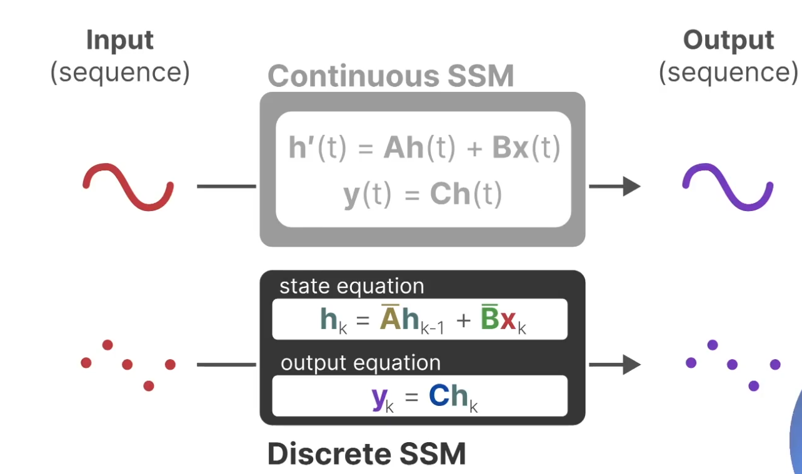
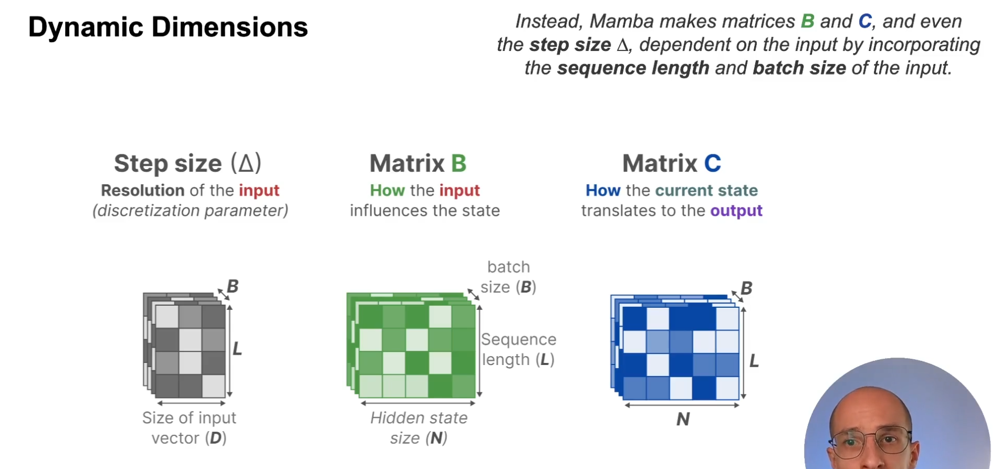

# Introduction
Ce fichier markdown contient un résumé des recherches effectuées pour le projet MambaVision. Il est divisé en plusieurs sections, chacune correspondant à source différente.<br>
Chaque section pourra contenir des images, copies d'écran, liens et autres ressources pertinentes pour le projet.<br>
Il sera établie une synthèse de chaque source qui pourra alimenter un travail ultérieur sur le projet en les utilisant comme contexte lors d'un RAG.<br>

# Lexique
## Backbone / Encoder :
Architecture principale qui extrait des représentations compactes et informatives d'une image. Les premiers backbones étaient basés sur des réseaux de neurones convolutifs (CNN), mais les architectures modernes utilisent souvent des transformateurs, qui sont plus efficaces pour capturer les relations à long terme dans les données visuelles.
Liste des backbones :
- Deep Convolutional Neural Networks (DCNN) : VGG, ResNet, Inception, EfficientNet, etc.
- Vision Transformers (ViT) : ViT, DeiT, Swin Transformer, etc.
- Vision Language Models (VLM) : CLIP, ALIGN, etc.
- Vision Language Transformer (ViLT)
- Mamba ? ```TODO```
- SSM ? ```TODO```
- Hybrid Mamba Transformer ? ```TODO```

## Decoder :
Architecture qui prend les représentations extraites par le backbone et les reconstruit en une sortie de la même taille que l'entrée. Dans le cas de la segmentation sémantique, le décodeur reconstruit une image à partir des caractéristiques extraites par le backbone, permettant ainsi de prédire des masques de segmentation pour chaque pixel de l'image d'entrée.

## Bottleneck :
Dans U-Net, on aborde souvent le concept de "bottleneck" qui est une couche intermédiaire entre l'encodeur et le décodeur. Il s'agit d'une couche qui réduit la dimensionnalité des données tout en préservant les informations essentielles. 

## MLP head :
Le Multi Layer Perceptron (MLP) est un type de réseau de neurones qui se compose de plusieurs couches Fully-Connected. Il est souvent utilisé comme tête de classification dans les architectures de réseaux de neurones pour effectuer des tâches telles que la classification d'images ou la régression. On parle de classification head, segmentation head, etc. selon la tâche à accomplir.

## Transformer :
Architecture de réseau de neurones qui utilise des mécanismes d'attention pour traiter les données séquentielles. Les transformateurs sont devenus populaires dans le traitement du langage naturel et sont maintenant utilisés dans la vision par ordinateur.

## Mamba :
```TODO```

## SSM - Selective State Model
```TODO```


# **Ressources**
=================
## 1. Papers & Publications
### 1.1. NVIDIA Research - MambaVision: A Hybrid Mamba Transformer Vision Backbone
URL : https://research.nvidia.com/publication/2025-06_mambavision-hybrid-mamba-transformer-vision-backbone


Synthèse:
- MambaVision est un backbone hybride qui combine les avantages des Mamba et des transformateurs pour la vision par ordinateur.
- Il est conçu pour être efficace en termes de calcul et de mémoire, tout en offrant des performances de pointe sur plusieurs tâches de vision.
- Démonstration via une étude d'ablation des composants de l'architecture et prouver l'efficacité d'intégérer d'intégrer dans les blocks MAMBA des blocks de self-attention propres aux ViT améliore ce qui faisait défaut à MAMBA.
- MambaVision sur ImageNet 1K SOTA top-1 accuracy (87.4% et 2.5x plus rapide que le ViT de base ????). ```TODO```
- Performe de la classification d'images à la segmentation sémantique, en passant par la détection d'objets et la segmentation d'instance.

Auteurs :
- Ali Hatamizadeh
- Jan Kautz

Contexte des princpipaux de papiers qui ont précédé :
- 
- 
- 


## 2. **Analytics Vidhya - Building LLM with Mamba & SSM**
URL: https://courses.analyticsvidhya.com/courses/take/building-smarter-llms-with-mamba-and-state-space-model/lessons/58249724-course-overview

### **Avantages et inconvénient des Transformers**
Le Transformer est souvent composé d'un encodeur et d'un décodeur, où l'encodeur extrait des caractéristiques de la séquence d'entrée et le décodeur génère la séquence de sortie.<br>
Certains modèles transformer n'ont pas d'encodeur et utilisent uniquement un décodeur, comme le modèle GPT.<br>
- L'input est une séquence de tokens discontinue et discret.
- Le mécanisme d'attention permets de choisir sélectivement les tokens à traiter et d'ignorer les autres en fonction de leur score d'attention dans la matrice d'attention.
- La complexité de l'attention est quadratique par rapport à la longueur de la séquence et très coûteux en termes de mémoire pour l'inférence.
- La taille du contexte est limitée par la longueur de la séquence d'entrée, ce qui peut poser des problèmes pour les tâches nécessitant une compréhension à long terme.

#### **Structure du décodeur**
Le decoder block consiste en 2 principaux composants, masked self-attention suivi d'un feed-forward neural network (FFN).<br>


#### **Self-Attention - Matrice d'attention**
Le mécanisme de **self-attention** créé une matrice d'attention qui est utilisée pour **pondérer les éléments de la séquence d'entrée** en comparant chaque token de la séquence avec tous les autres tokens dont les caractéristiques suivantes:
- Elle est calculée en multipliant la matrice de requête (Q) par la matrice de clé (K) transposée, puis en appliquant une fonction softmax pour normaliser les poids d'attention.
- Elle est ensuite multipliée par la matrice de valeur (V) pour obtenir la sortie de la couche d'attention.
- Elle est de taille carrée (n, n) où n est la longueur de la séquence d'entrée.


#### **Curse of Inference : Expensive Inference**
A chaque nouveau token généré par le décodeur lors de l'inférence, **il doit recalculer la matrice d'attention** pour l'ensemble de la séquence d'entrée.<br>
Cela peut devenir coûteux en termes **de temps et de mémoire**, surtout pour les longues séquences.<br>
**Pour chaque nouveau token, la complexité de l'attention est O(n^2)** où n est la longueur de la séquence d'entrée.<br>
**La taille du contexte est forcément limité à un maximum.**<br>

#### **Parallelisation : Great for Training**
Le mécanisme d'attention est **hautement parallélisable**, ce qui permet de traiter plusieurs tokens simultanément.<br>
Cependant, la complexité quadratique de l'attention demande beaucoup de mémoire et aussi de complexité computationnelle et nécessite souvent des ressources démesurées.<br>
**Lors de l'entraînement, toute la séquence d'entrée est disponible**, ce qui permet de calculer la matrice d'attention pour l'ensemble de la séquence **en une seule passe**.<br>
Cela permet d'accélérer l'entraînement et **de réduire le temps de calcul par rapport à une approche séquentielle comme sur les RNN**. <br>


### **RNN & NLP**
La structure de base d'un RNN est un réseau de neurones récurrent qui traite les séquences d'entrée en utilisant des connexions récurrentes pour capturer les dépendances temporelles.<br>
Le contexte est maintenu compressé dans un vecteur d'état caché, qui est mis à jour à chaque étape de la séquence avec les caractéristiques suivantes :
- L'hidden state est un état compressé et nécessite seulement le dernier état caché pour prédire le prochain token. Toute la séquence, même si elle n'est pas pertinente, est compressée dans qui servira de contexte pour la prédiction du prochain token. Cela résulte d'une moins bonne précision quand la séquence est longue et d'éléments non pertinents conservés dans l'hidden state.
- **La complexité de l'inférence est linéaire par rapport à la longueur de la séquence**, ce qui le rend plus efficace pour les longues séquences **contrairement aux transformers qui doivent recalculer la matrice d'attention pour chaque token**.<br>
- Il n'y a pas de limite de taille de la séquence d'entrée, ce qui permet de traiter des séquences de longueur variable sans avoir à tronquer ou à remplir la séquence d'entrée.<br>


Toutefois, plus la séquence d'entrée est longue, **plus l'information "longue distance" est très compressée et difficile à récupérer**. **L'information "courte distance" est mieux préservée dans l'état caché.**


### **State Space Model (SSM)**
#### **L'espace des états | State Space**
Un espace des états est une représentation mathématique d'un système dynamique qui décrit l'évolution de l'état du système au fil du temps.<br>
Il est une représentation compléte du système avec le minimum de variables d'état nécessaires pour décrire le système.<br>
Le SSM a été conçu pour traiter des séquences continues comme un signal, où chaque état est représenté par un vecteur d'état (State Vector) qui capture les caractéristiques essentielles du système à un instant donné.<br>


Il est possible de représenter les State Vector en fonction de leur position dans l'espace des états de deux manières :


Le State Vector a 3 composantes dans ce cas :


#### **What is a SSM?**
Le modèle d'espace d'état est un modèle mathématique qui décrit **ces représentations d'état** et fait **des prédictions du prochain état** en fonction de **l'input.**


Le SSM comporte deux principales équations :
- L'équation d'état (State Equation) qui décrit comment **l'état du système est mis à jour, h'(t)**, en fonction de **l'entrée, x(t)**, et de **l'état précédent, h(t)**.
- L'équation de sortie (Output Equation) qui décrit comment est prédit le prochain état, **y(t)**, en fonction de **l'état actuel, h(t)** et de **l'entrée, x(t)**.


Voici deux représentations du modèles, une globale et une détaillée, avec l'enchaînement des étapes de calcul :


#### **Quantifier les entrées et sorties : Zero-Order Hold**

Le SSM est conçu pour traiter des séquences continues, mais il peut être adapté pour traiter des entrées discrètes en utilisant une approche de quantification.<br>
La quantification consiste à diviser l'espace d'entrée en plusieurs régions à l'aide de l'unité de quantification le **step size**. Cela permet de représenter **les entrées discrètes** comme des vecteurs d'état dans l'espace des états et aussi de représenter **les sorties discrètes**.<br>


Voici comment le Zero-Order Hold fonctionne avec les matrics A et B pour les discretiser les entrées et sorties :




#### **Recurrent representation : Better for inference**
A l'image du RNN, le SSM est très bon pour l'inférence mais plus coûteux pour l'entraînement avec son approche séquentielle.<br>


#### **Convolution representation : Better for training**
Pour contourner l'approche séquentielle, le SSM peut être utilisé avec des convolutions pour traiter les séquences d'entrée de manière plus efficace.<br>
Les convolutions permettent de capturer les dépendances locales dans les données d'entrée, ce qui est particulièrement utile pour les tâches de traitement du langage naturel et de vision par ordinateur.<br>
Par exemple, on traitement des triplets de tokens en parallèle, ce qui permet de réduire le coût de l'inférence et d'améliorer la vitesse de traitement.<br>
L'hidden state ne dépend plus des étapes "précédentes" mais de l'ensemble de la fenêtre de convolution ce qui rends le processus d'entrainement parallelisable.<br>


La limite de cette approche avec les convolutions est qu'il est nécessaire lors de l'inférence de **recalculer à chaque nouveau token l'etat caché de l'ensemble de la fenêtre de convolution**, ce qui est coûteux en termes de temps et de mémoire.<br>
La taille du kernel limite l'attention locale et ne tient plus compte de toute la séquence d'entrée.<br>
Il est donc nécessaire de **trouver un compromis entre l'approche séquentielle et l'approche par convolution pour obtenir un modèle efficace pour l'inférence et l'entraînement**.<br>

#### Mixed Representation : Linear State-Space Layer (LSSL)
Le LSSL est une approche qui combine les avantages des SSM et des convolutions pour utiliser le meilleur de l'approché récurrente et convolutionnelle:
- Convolutions pour l'entraînement : Le LSSL utilise des convolutions pour traiter les séquences d'entrée de manière efficace pendant l'entraînement, ce qui permet de capturer les dépendances locales et de paralléliser le processus d'entraînement.
- Représentation d'état récurrente pour l'inférence : Pendant l'inférence, le LSSL utilise une représentation d'état récurrente pour traiter les séquences d'entrée, ce qui permet de capturer les dépendances à long terme et de réduire le coût de l'inférence.


#### **Les limites des SSM et l'arrivée de S4**
##### a. **Linear Time Invariance of SSM**
Le SSM est linéaire et invariant dans le temps, ce qui signifie que les propriétés du système ne changent pas au fil du temps (Matrices A, B, C, D). Cela permet de simplifier les calculs et d'améliorer l'efficacité du modèle.<br>
Il est donc particulièrement adapté aux signaux bruités et aux données séquentielles, car il peut capturer les dépendances à long terme tout en étant robuste aux variations temporelles.<br>
Toutefois, **cela nuit à "l'attention" locale** et **empêche le processus sélectif à l'image des transformers** puisque les matrices A et B qui touchent l'input sont **invariantes et indépendantes de l'input**.<br>

##### b. **La compression de l'hidden-state et sa projection dépendante de la matrice A**
On l'a vu précédemment, la compression de l'hidden state affecte davantage les entrées les plus anciennes que les récentes.<br>
De plus la mise à jour de l'état caché est hautement dépendante de la matrice A qui est **invariante et indépendante de l'input**.<br>


##### c. **Décompresser l'hidden-state et reconstruire le signal d'entrée? HiPPO A matrix !**
A cause du mécanisme de compression, la méthode HiPPO (High-Order Input Output) a été introduite pour décompresser l'état caché et reconstruire le signal d'entrée.<br>
La reconstruction permets de mieux tenir compte davatange des signaux récents que des plus anciens.<br>
Cela permets de conserver l'information la plus ancienne de la séquence comme un contexte globale alors que les détails les plus récents de la séquence sont restitués avec un niveau de détail plus fin portant davantage d'attention sur les entrées récentes pour prédire le prochain token.<br>




##### d. **L'architecture S4: Strcutured State Space for Sequences**
L'architecture S4 combine toutes les améliorations précédemment vues avec l'ajout de HiPPO.<br>


### **MAMBA**
L'architecture MAMBA apporte deux principales contributions à S4:
- **Un selective scan algorithm**, qui introduit un mecanisme similaire à l'attention pour sélectionner les tokens pertinents dans la séquence d'entrée. (ref. : selective state space model)
- **Un hardware-aware algorithm**, qui utilise en interne parallel scan, kernel fusion et recomputation, pour optimiser les calculs en parallèle.


Cela permets de résoudre les problèmes suivants:
- **Selective copying task** : Sélectionner les tokens pertinents dans la séquence d'entrée pour pouvoir effectuer l'inférence ce qui est actuellement impossible à cause de la nature "compressée" de l'état caché et la nature Lineaire et Invariante du SSM à cause notamment des matrices A et B (liés à l'input et le précedent état caché).
- **Induction heads task** : Reproduire des schémas/patterns dans la séquence d'entrée dans la séquence de sortie (**à l'image des few shot prompts**)

#### Sélection compressive de l'état caché


## 3. **Related News**
### 3.1. VentureBeat - MambaVision: A Hybrid Mamba Transformer Vision Backbone
URL: https://venturebeat.com/ai/beyond-transformers-nvidias-mambavision-aims-to-unlock-faster-cheaper-enterprise-computer-vision/

Synthèse:
- Release de MambaVision research en 2024 par NVIDIA.
- Release de plusiuers modèles pré-entraînés sur huggingface.
- The promise of MambaVision for enterprise is that it could improve the efficiency and accuracy of vision operations, at potentially lower costs, thanks to lower computational requirements.